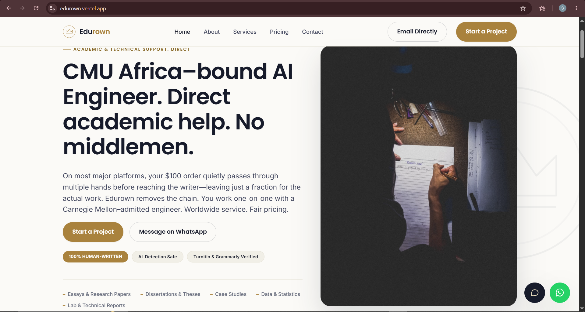
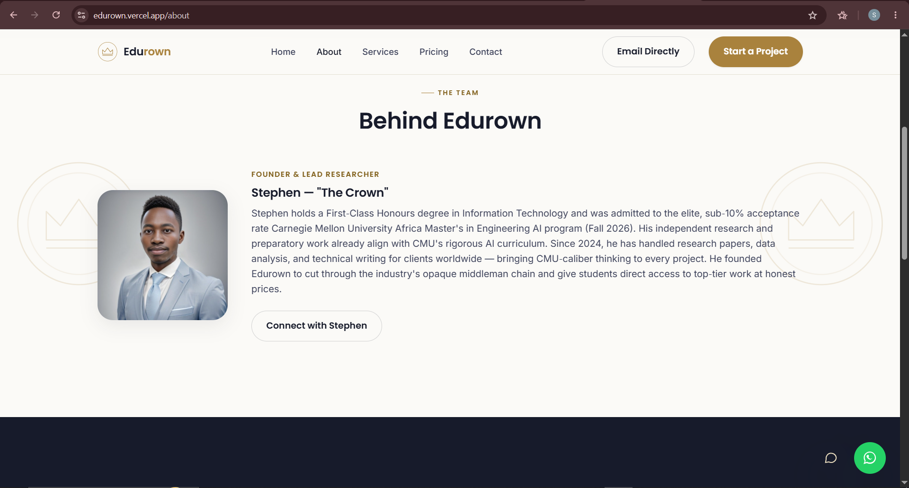
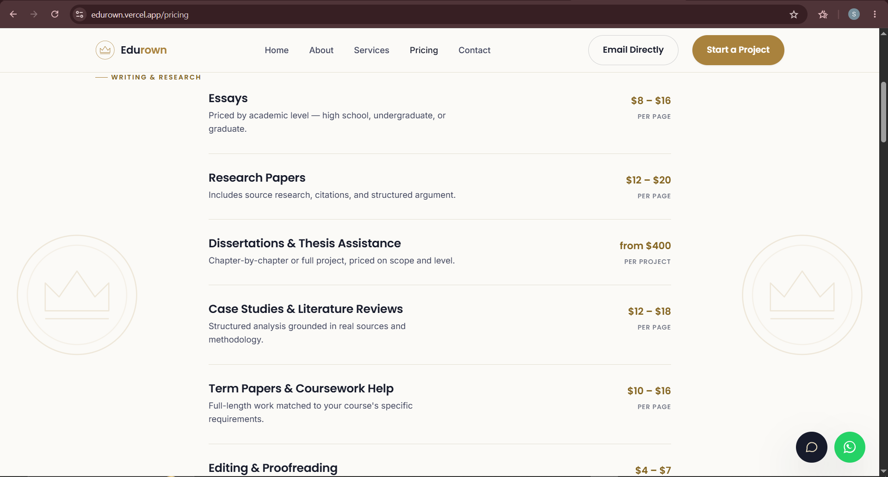

# Edurown — Direct Academic & Technical Writing Support

**Edurown** is a direct, personal academic and technical writing support service for students and professionals worldwide. No middlemen, no bidding pools — just clear communication and careful work, start to finish.

🔗 **Live Site:** [edurown.vercel.app](https://edurown.vercel.app)

---

## 📌 Overview

Edurown was built to cut through the opaque middleman chain that exists on platforms like Edusson, EduBirdie, and Nerdy. When you pay $100 on these platforms, the writer often receives just $25 or less. Edurown removes the layers — students pay less, writers get paid fairly, and quality stays high.

---

## 🚀 Features

- **📝 Academic Writing:** Essays, research papers, dissertations, case studies, and term papers
- **📊 Data & Statistical Analysis:** Data visualization, statistical testing, and clear write-ups
- **💻 Technical Projects:** Web development, coding, and applied coursework
- **🔬 Lab & Technical Reports:** Bioimage analysis, cybersecurity reports, and more
- **✏️ Editing & Proofreading:** Line-by-line review for clarity, grammar, and citations
- **🌍 Worldwide Service:** Comfortable working across time zones and formatting standards

---

## 🛠️ Tech Stack

| **Category** | **Technologies** |
| :--- | :--- |
| **Frontend** | HTML5, CSS3, JavaScript |
| **Hosting** | Vercel |
| **Design System** | Custom CSS with Inter & Poppins fonts |
| **Version Control** | Git & GitHub |

---

## 📁 Project Structure

edurown/
├── index.html # Homepage
├── about.html # About page
├── services.html # Services page
├── pricing.html # Pricing page
├── contact.html # Contact page
├── css/
│ └── styles.css # Main stylesheet
├── js/
│ └── script.js # JavaScript functionality
├── images/
│ └── about/
│ └── founder.jpg # Founder's photo
├── vercel.json # Vercel deployment config
└── README.md # This file

---

## 📸 Screenshots

### Homepage

### About Page

### Pricing Page

---

## 🚀 Getting Started

### Prerequisites

- A web browser
- A code editor (VS Code recommended)

### Local Development

1. Clone the repository

git clone https://github.com/Crowndus/Edurown.git
cd Edurown

2. Open in your browser
- Simply open `index.html` in your browser

3. Make changes
- Edit the HTML files for content changes
- Modify `css/styles.css` for styling

### Deploy to Vercel

1. Push your changes to GitHub
2. Go to [vercel.com](https://vercel.com)
3. Click "Add New Project" → Import your GitHub repository
4. Click "Deploy"

---

## 📫 Contact

- **Website:** [edurown.vercel.app](https://edurown.vercel.app)
- **Email:** stephen.kisangi1@gmail.com
- **WhatsApp:** [+254 792 915655](https://wa.me/254792915655)
- **GitHub:** [Crowndus](https://github.com/Crowndus)

---

## 📄 License

This project is licensed under the MIT License — see the [LICENSE](LICENSE) file for details.

---

*"Solving problems, always. We're getting there."* 🚀
